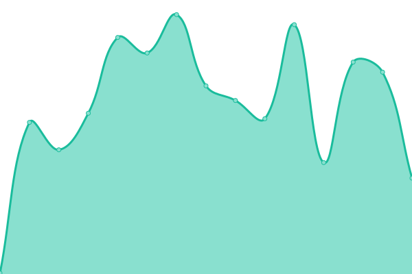

# [📈 Live Status](https://EnderdracheLP.github.io/Beat-Saber-Uptime/): <!--live status--> **🟧 Partial outage**

This repository contains the open-source uptime monitor and status page for [EnderdracheLP](https://EnderdracheLP.github.io/Beat-Saber-Uptime/), powered by [Upptime](https://github.com/upptime/upptime).

With [Upptime](https://upptime.js.org), you can get your own unlimited and free uptime monitor and status page, powered entirely by a GitHub repository. We use [Issues](https://github.com/EnderdracheLP/Beat-Saber-Uptime/issues) as incident reports, [Actions](https://github.com/EnderdracheLP/Beat-Saber-Uptime/actions) as uptime monitors, and [Pages](https://EnderdracheLP.github.io/Beat-Saber-Uptime) for the status page.

<!--start: status pages-->
<!-- This summary is generated by Upptime (https://github.com/upptime/upptime) -->
<!-- Do not edit this manually, your changes will be overwritten -->
<!-- prettier-ignore -->
| URL | Status | History | Response Time | Uptime |
| --- | ------ | ------- | ------------- | ------ |
|  [BeastSaber](https://bsaber.com) | 🟩 Up | [beast-saber.yml](https://github.com/EnderdracheLP/Beat-Saber-Uptime/commits/HEAD/history/beast-saber.yml) | 

 153ms
     
 | 

<a href="https://status.elp.quest/history/beast-saber">100.00%</a>
    

|  [BeatSaver](https://beatsaver.com) | 🟩 Up | [beat-saver.yml](https://github.com/EnderdracheLP/Beat-Saber-Uptime/commits/HEAD/history/beat-saver.yml) | 

 465ms
     
 | 

<a href="https://status.elp.quest/history/beat-saver">99.61%</a>
    

|  [QuestBoard](https://www.questmodding.com) | 🟩 Up | [quest-board.yml](https://github.com/EnderdracheLP/Beat-Saber-Uptime/commits/HEAD/history/quest-board.yml) | 

 698ms
     
 | 

<a href="https://status.elp.quest/history/quest-board">100.00%</a>
    

|  [BeatMods](https://beatmods.com/) | 🟩 Up | [beat-mods.yml](https://github.com/EnderdracheLP/Beat-Saber-Uptime/commits/HEAD/history/beat-mods.yml) | 

 457ms
     
 | 

<a href="https://status.elp.quest/history/beat-mods">100.00%</a>
    

|  [BMBF](https://bmbf.dev) | 🟩 Up | [bmbf.yml](https://github.com/EnderdracheLP/Beat-Saber-Uptime/commits/HEAD/history/bmbf.yml) | 

 171ms
     
 | 

<a href="https://status.elp.quest/history/bmbf">100.00%</a>
    

|  [ModelSaber](https://modelsaber.com) | 🟩 Up | [model-saber.yml](https://github.com/EnderdracheLP/Beat-Saber-Uptime/commits/HEAD/history/model-saber.yml) | 

 420ms
     
 | 

<a href="https://status.elp.quest/history/model-saber">100.00%</a>
    

|  [ScoreSaber](https://scoresaber.com) | 🟩 Up | [score-saber.yml](https://github.com/EnderdracheLP/Beat-Saber-Uptime/commits/HEAD/history/score-saber.yml) | 

 276ms
     
 | 

<a href="https://status.elp.quest/history/score-saber">100.00%</a>
    

|  [BSMG Wiki](https://bsmg.wiki) | 🟩 Up | [bsmg-wiki.yml](https://github.com/EnderdracheLP/Beat-Saber-Uptime/commits/HEAD/history/bsmg-wiki.yml) | 

 272ms
     
 | 

<a href="https://status.elp.quest/history/bsmg-wiki">100.00%</a>
    

|  [QPackages (Backend)](https://qpackages.com/) | 🟩 Up | [q-packages-backend.yml](https://github.com/EnderdracheLP/Beat-Saber-Uptime/commits/HEAD/history/q-packages-backend.yml) | 

 682ms
     
 | 

<a href="https://status.elp.quest/history/q-packages-backend">100.00%</a>
    

|  [Bobbie.dev](https://bobbie.dev/) | 🟩 Up | [bobbie-dev.yml](https://github.com/EnderdracheLP/Beat-Saber-Uptime/commits/HEAD/history/bobbie-dev.yml) | 

 140ms
     
 | 

<a href="https://status.elp.quest/history/bobbie-dev">100.00%</a>
    

|  [Beat Saber Legacy](https://bslegacy.com) | 🟥 Down | [beat-saber-legacy.yml](https://github.com/EnderdracheLP/Beat-Saber-Uptime/commits/HEAD/history/beat-saber-legacy.yml) | 

 114ms
     
 | 

<a href="https://status.elp.quest/history/beat-saber-legacy">43.28%</a>
    

|  [OculusDB](https://oculusdb.rui2015.me/) | 🟩 Up | [oculus-db.yml](https://github.com/EnderdracheLP/Beat-Saber-Uptime/commits/HEAD/history/oculus-db.yml) | 

 481ms
     
 | 

<a href="https://status.elp.quest/history/oculus-db">100.00%</a>
    

|  Official MP Server Status - ProductionA | 🟩 Up | [official-mp-server-status-production-a.yml](https://github.com/EnderdracheLP/Beat-Saber-Uptime/commits/HEAD/history/official-mp-server-status-production-a.yml) | 

 305ms
     
 | 

<a href="https://status.elp.quest/history/official-mp-server-status-production-a">99.74%</a>
    

|  Official MP Server Status - ProductionB | 🟩 Up | [official-mp-server-status-production-b.yml](https://github.com/EnderdracheLP/Beat-Saber-Uptime/commits/HEAD/history/official-mp-server-status-production-b.yml) | 

 76ms
     
 | 

<a href="https://status.elp.quest/history/official-mp-server-status-production-b">99.74%</a>
    

|  Beat Together Server Status | 🟩 Up | [beat-together-server-status.yml](https://github.com/EnderdracheLP/Beat-Saber-Uptime/commits/HEAD/history/beat-together-server-status.yml) | 

 194ms
     
 | 

<a href="https://status.elp.quest/history/beat-together-server-status">100.00%</a>
    

<!--end: status pages-->

[**Visit our status website →**](https://EnderdracheLP.github.io/Beat-Saber-Uptime/)

## 📄 License

- Powered by: [Upptime](https://github.com/upptime/upptime)
- Code: [MIT](./LICENSE) © [EnderdracheLP](https://EnderdracheLP.github.io/Beat-Saber-Uptime/)
- Data in the `./history` directory: [Open Database License](https://opendatacommons.org/licenses/odbl/1-0/)
